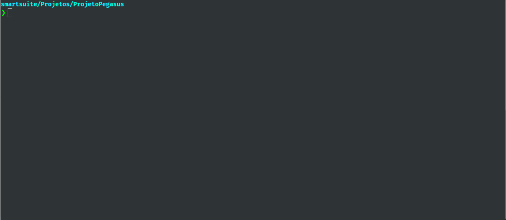

# Instalação do Oh-my-zsh e plugins:

## Oh-my-zsh: (via curl)

``$ sh -c "$(curl -fsSL https://raw.github.com/ohmyzsh/ohmyzsh/master/tools/install.sh)"``

### Tema: SpaceShip:

### Clone no repositório:
`` $ git clone https://github.com/denysdovhan/spaceship-prompt.git "$ZSH_CUSTOM/themes/spaceship-prompt"``

### Symlink:
`` $ ln -s "$ZSH_CUSTOM/themes/spaceship-prompt/spaceship.zsh-theme" "$ZSH_CUSTOM/themes/spaceship.zsh-theme"``

Abra o arquivo de configuração do ohmyzsh e altere o tema para o spaceship

``$ code ~/.zshrc``

ZSH_THEME="spaceship"

### Inserir informações adicionais no final do arquivo:

```
SPACESHIP_PROMPT_ORDER=(
  user
  dir
  host
  git
  node
  docker
  package  
  battery
  exec_time
  line_sep
  vi_mode
  jobs
  exit_code
  char
)

SPACESHIP_PROMPT_ADD_NEWLINE=false
SPACESHIP_CHAR_SYMBOL="❯"
SPACESHIP_CHAR_SUFFIX=" "
```

#Plugins

# Step 1: clone repo for auto-suggestion / auto-update / highlight

```
git clone https://github.com/zsh-users/zsh-autosuggestions.git $ZSH_CUSTOM/plugins/zsh-autosuggestions
git clone https://github.com/TamCore/autoupdate-oh-my-zsh-plugins $ZSH_CUSTOM/plugins/autoupdate
git clone https://github.com/zsh-users/zsh-syntax-highlighting.git ${ZSH_CUSTOM:-~/.oh-my-zsh/custom}/plugins/zsh-syntax-highlighting
```


# Step 2: open config file 
code ~/.zshrc

# Step 3: 

plugins=(git zsh-autosuggestions autoupdate zsh-syntax-highlighting)

## E confira o resultado final
Exibindo a versão do Node, NPM, branch do git, etc...

